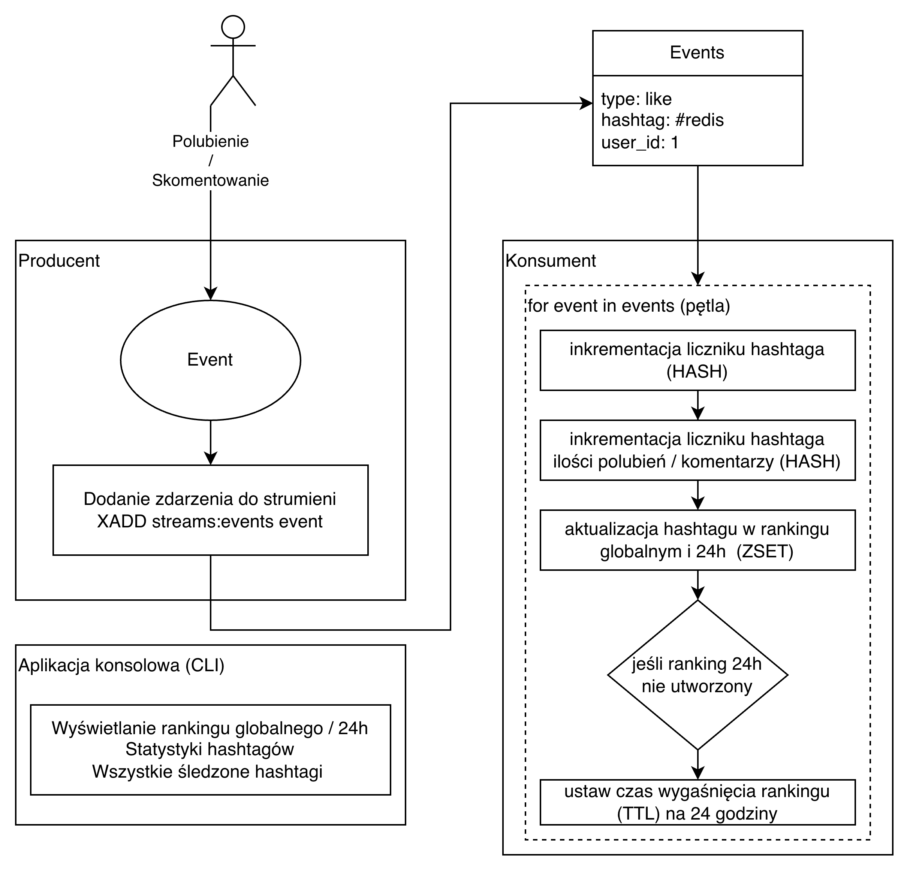

# Redis Social Media Trend Analytics (Real-Time)

A small real-time analytics system that simulates social media interactions (**likes** and **comments**) and computes **hashtag trends** using **Redis**.

This project was built as a **NoSQL coursework** project.

---

## What the project does

The system supports:

- registering events (likes and comments),
- processing events in near real time,
- aggregating per-hashtag statistics (likes, comments, total events),
- building a **TOP-N hashtag ranking** (global),
- building a **time-window ranking** (24h) using **TTL**,
- interactive usage via a **CLI menu**,
- exporting aggregated hashtag statistics to **CSV** (for offline analysis).

---

## Why Redis?

Redis is a **key-value NoSQL** database that stores data **in-memory**, which makes reads/writes extremely fast.  
This project fits Redis well because it needs:

- an **event stream**,
- **counters / aggregates**,
- a fast **ranking**,
- a **time window** (data expiration).

Redis provides built-in structures that map directly to these needs:

- **Streams** → event log (`stream:events`)
- **Hashes** → per-hashtag aggregated stats (`hashtag:{tag}`)
- **Sorted Sets (ZSET)** → rankings (`ranking:hashtags`, `ranking:hashtags:24h`)
- **TTL** → automatic expiration for the 24h ranking

Compared to a relational database, this approach avoids heavy aggregation queries and uses Redis-native operations for fast updates and reads.

---

## Architecture (high level)

1. A producer generates events (`like` / `comment`) for hashtags and appends them to a Redis Stream.
2. A consumer reads **only new events** (based on the last processed stream ID).
3. The consumer updates:
   - per-hashtag aggregates stored in a Redis Hash (`likes`, `comments`, `count`)
   - global and time-window rankings stored in Redis Sorted Sets
4. A CLI application displays results and allows managing the system.

Optional diagram:



---

## Code structure

- `event_producer.py` – generates and appends events to Redis Stream
- `event_consumer.py` – processes new events and updates aggregates + rankings
- `analytics.py` – reads rankings and hashtag stats
- `app.py` – interactive CLI menu
- `export_csv.py` – exports aggregated hashtag stats to CSV

---

## Redis data model

### Stream (events)
- Key: `stream:events`
- Stores fields: `type`, `hashtag`, `user_id`, `timestamp`

### Hash (per-hashtag aggregates)
- Key: `hashtag:{tag}` (e.g. `hashtag:#redis`)
- Fields: `likes`, `comments`, `count`

### Sorted Sets (rankings)
- Global ranking: `ranking:hashtags`
- Time-window ranking: `ranking:hashtags:24h`

### Time window (TTL)
- `ranking:hashtags:24h` is created/updated by the consumer and has a TTL
- TTL is set once per window (**fixed time window** behavior)

---

## Ranking logic

The ranking uses weighted interactions:

- `like = 1 point`
- `comment = 2 points`

This makes comments more influential than likes (higher engagement).

---

## How to run

### 1) Start Redis (Docker)

```bash
docker run --name redis-trending -p 6379:6379 -d redis
